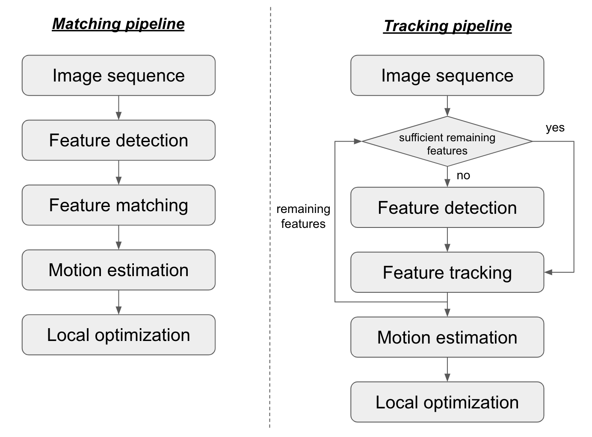

# Monocular Feature-Based Visual Odometry using Python OpenCV

Welcome! This is our final project for course CS543-Computer-Vision in 2023 Fall. The course page can be found [here](http://luthuli.cs.uiuc.edu/~daf/courses/CV23/CV23.html).

The project implements a 2D-to-2D feature-based visual odometry, conducting experiments on different various methods across different components of the visual odometry process.

Please check out my portfolio post for a greater detailed description.

## Overview

## Method

The project includes two typical pipelines of feature-based visual odometry: matching & tracking. In general, the system receives frames in a sequential manner. Then it identifies corresponding feature pairs between $t-1$ and $t$, and finally do motion estimation and optimization across frames.

We implement various algorithms across each components and compare their performance:
1. Feature detection: ORB, SIFT, BRIEF, FAST
2. Feature matching: BF, FLANN
3. Feature tracking: Lucas–Kanade
3. Motion estimation: Nister’s 5-point and 8-point algorithm with RANSAC.
4. (TODO) Optimization: pose-graph

## Quick Starter Guide

## Results

## TODO
- [ ] pose-graph optimization